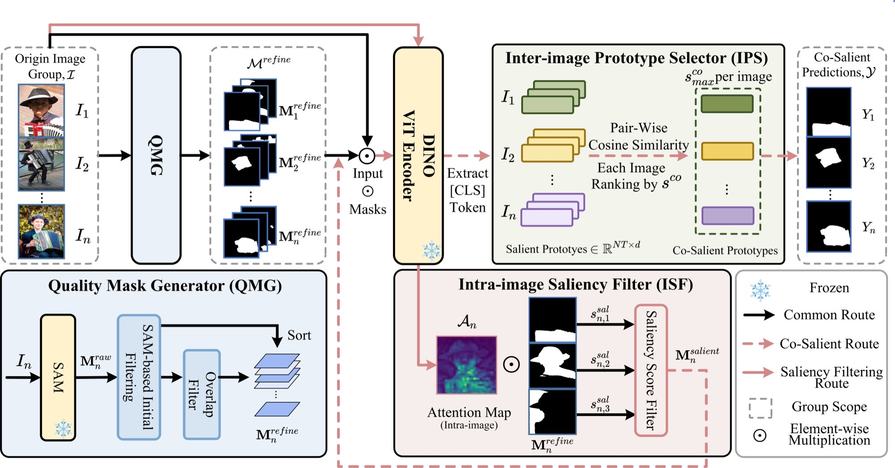
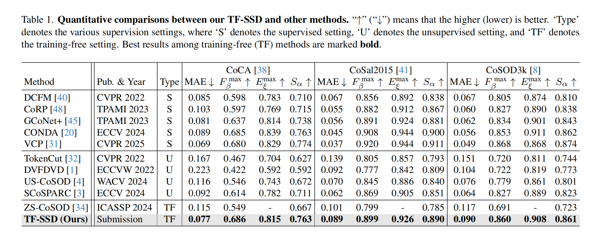

# TF-SSD: A Strong Pipeline via Synergic Mask Filter for Training-free Co-salient Object Detection

> **CVPR 2026**
> Zhijin He\*, Shuo Jin\*, Siyue Yu†, Shuwei Wu, Bingfeng Zhang, Li Yu, Jimin Xiao
> XJTLU · University of Liverpool · China University of Petroleum · NUIST

[](https://openaccess.thecvf.com/content/CVPR2026/papers/He_TF-SSD_A_Strong_Pipeline_via_Synergic_Mask_Filter_for_Training-free_CVPR_2026_paper.pdf)
[](LICENSE)

---

## Abstract

Co-salient Object Detection (CoSOD) aims to segment salient objects that consistently appear across a group of related images. Despite notable progress from training-based approaches, they remain constrained by closed-set datasets and exhibit limited generalization. In this paper, we propose **TF-SSD**, a novel training-free method that leverages Vision Foundation Models (VFMs) — specifically SAM and DINO — for CoSOD. Our framework progressively narrows SAM's exhaustive mask proposals to co-salient predictions via three components: a **Quality Mask Generator (QMG)**, an **Intra-image Saliency Filter (ISF)**, and an **Inter-image Prototype Selector (IPS)**. Extensive experiments show that TF-SSD outperforms the existing training-free method by **13.7%** on F-measure and achieves competitive performance against training-based approaches without any task-specific training.

---

## Pipeline



---

## Results



TF-SSD outperforms all existing training-free methods across three benchmarks. Compared to ZS-CoSOD (ICASSP 2024), our method achieves gains of **13.7% F-measure** and **9.6% S-measure** on CoCA, and **10.0% F-measure** on CoSal2015.

---

## Installation

```bash
conda create -n tfssd python=3.10 -y
conda activate tfssd
pip install -r requirements.txt
```

**SAM**

```bash
pip install git+https://github.com/facebookresearch/segment-anything.git
mkdir -p checkpoints
wget https://dl.fbaipublicfiles.com/segment_anything/sam_vit_h_4b8939.pth -P checkpoints/
```

**DINO**

```bash
wget https://dl.fbaipublicfiles.com/dino/dino_vitbase8_pretrain/dino_vitbase8_pretrain.pth -P checkpoints/
```

Place `vision_transformer.py` from the [DINO repository](https://github.com/facebookresearch/dino/blob/main/vision_transformer.py) in the **project root**. This file is required by ISF and IPS for the `get_last_selfattention` interface.

---

## Datasets

Place the datasets under `datasets/` with the following structure:

```
datasets/
├── CoSal2015/
│   ├── image/
│   │   └── <group>/  *.jpg
│   └── gt/
│       └── <group>/  *.png
├── CoSOD3k/
│   ├── image/
│   └── gt/
└── CoCA/
    ├── image/
    └── gt/
```

| Dataset | Groups | Images | Download |
|:-------:|:------:|:------:|:--------:|
| CoSal2015 | 50 | 2,015 | [Link](http://www.zengwei.site/CoSal2015) |
| CoSOD3k   | 160 | 3,316 | [Link](http://dpfan.net/CoSOD3K/) |
| CoCA      | 80 | 1,295 | [Link](http://dpfan.net/CoCA/) |

---

## Usage

**Single dataset:**
```bash
bash scripts/run_inference.sh configs/cosal2015.yaml CoSal2015 \
    ./checkpoints/sam_vit_h_4b8939.pth \
    ./checkpoints/dino_vitbase8_pretrain.pth
```

**All datasets:**
```bash
bash scripts/run_all.sh \
    ./checkpoints/sam_vit_h_4b8939.pth \
    ./checkpoints/dino_vitbase8_pretrain.pth
```

**Evaluation:**
```bash
python evaluate.py --config configs/cosal2015.yaml --dataset_name CoSal2015
```

---

## Citation

```bibtex
@inproceedings{he2026tfssd,
  title     = {TF-SSD: A Strong Pipeline via Synergic Mask Filter for Training-free Co-salient Object Detection},
  author    = {He, Zhijin and Jin, Shuo and Yu, Siyue and Wu, Shuwei and Zhang, Bingfeng and Yu, Li and Xiao, Jimin},
  booktitle = {Proceedings of the IEEE/CVF Conference on Computer Vision and Pattern Recognition (CVPR)},
  year      = {2026},
}
```


